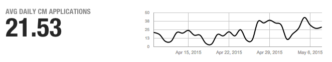
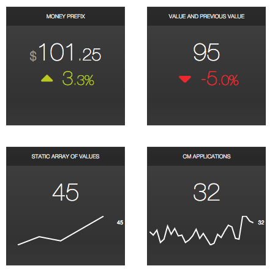

# ui-stats

## Summary

`ui-stats` is a series of polymer components which allow you to quickly and easily create a
[statusboard](https://services.glgresearch.com/statusboard) to track whatever it is you need to track. Data can be loaded explicitly, programmatically, or more commonly via URL. Different components can generate different types of tiles for displaying different types of data.

Check out the [demo](https://services.glgresearch.com/ui-stats/)


## Installation and Usage

Import polymer and the `ui-stats` component, easiest to use the shared instance, but locally is fine too.

```html
<link rel="import" href="https://services.glgresearch.com/ui-toolkit/polymer.html">
<link rel="import" href="https://services.glgresearch.com/ui-toolkit/node_modules/ui-stats/src/ui-stats.html">
```

Due to a bug in polymer libraries, if you don't have a `<script>` tag in your document's `<head>`
you'll need to add one, though it can be empty. Here's a starting template that puts it all together.

```html
<!DOCTYPE html>
<html>
  <head>
    <script><!-- work around polymer bug, that requires a script tag in head --></script>
    <link rel="import" href="https://services.glgresearch.com/ui-toolkit/polymer.html">
    <link rel="import" href="https://services.glgresearch.com/ui-toolkit/node_modules/ui-stats/src/ui-stats.html">
  </head>

  <body>
    <ui-stats-timeline label="CM Acceptance Percentage" units="%" groupBy="week" valueProperty="accept_rate"
      src="https://query.glgroup.com/councilApplicant/getStats.mustache">
    </ui-stats-timeline>
  </body>

</html>
```

## ui-stats-timeline

Display a value and its changes over time, with optional grouping by month, day, or hour. You can pass
propertly formated JSON data via the `data` attribute, but the typical usage is to use the `src` attribute
to specify the URL of query that returns an array of JSON objects, and use the `dateProperty` and `valueProperty`
attributes to select your X and Y columns.

```html
<ui-stats-timeline label="Avg Daily CM Applications" groupBy="day" limit="30"
  src="https://query.glgroup.com/councilApplicant/getStats.mustache"
  valueProperty="applied">
</ui-stats-timeline>
```




### label

The name of the metric you are displaying

### src

### dateProperty

The name of the data property that holds the X-axis value. Must be a valid date. Defaults to `date`.

### datePattern

The moment.js date formatting pattern to use when parsing date values. Defaults to `YYYY-MM-DD`

### valueProperty

The name of the data property that holds the Y-axis value. Must be a number. Defaults to `value`

### valueProperties

An array of data properties for the Y-axis values. Will generate multi-series data with a legend.
If you specify multiple properties here, the `reduction` attribute will be applied to each series first,
and then to the collection of resulting values. Rolling up the roll ups as it were. If you want to hide
the primary metric, set the `reduction` attribute to `none`

### limit

The number of rows to keep (after applying any grouping), taken from the end of the list. Defaults
to MAX_INT

### groupBy

Grouping by date. One of either `hour`, `day`, `week`, or `month` which groups all the data by the start of
the time period, using your first date column as the key. Simply sums all the other property fields.
Defaults to group by day.

### groupByFunction

Sets the reduction function to apply when aggregating groupbed values. The default value
is `sum`. Possible values are: `first`, `last`, `sum`, `average`, `min`, `max`, and `count`.

### reduction

Sets the reduction function to apply the data values to create the primary metric. The default value
is `average`. Possible values are: `first`, `last`, `sum`, `average`, `min`, `max`, and `count`, 'cummulative'
and `none`. The value of `none` hides the metric area, just showing the graph.

### units

The units, for example `%` (between 0 and 1), `ms`, or some arbitrary string. Defaults to empty.
Note that the percentage symbol triggers % formatting.

### smooth

If `false` disables simple graphic smoothing.

### transform

Possible values are `movingAverage`, `weightedMovingAverage`, `cumulative` or `none`, defaults to `none`.
You can set the size of the sliding window for moving averages in parentheses. For example `movingAverage(3)`, defaults to `7`

### data

Explicitely set the object array of data, rather than loading it from a URL

### type

Type of chart, defaults to line. Useful values are `column` and `area`

### method

GET or POST, defaults to GET, applied only if src is specified

### trendline

If true, show a trendline

## ui-stats-number

The Number tile is focused on the display of a metric that can be represented by a single number, along with associated secondary metrics, such as a comparison to the previous value or a sparkline. For example:



Data can be provided in one of several ways:

* Via the `value` attribute, which specifies a single value:

  ```html
  <ui-stats-number value="55">
  </ui-stats>
  ```

* Via the `data` attribute, which takes an array of values:

  ```html
  <ui-stats-number data="[5, 10, 15, 20, 25]">
  </ui-stats>
  ```

  Or an array of quoted JSON objects, which requires use of the `property` attribute to specify which property is your primary metric.

  ```html
  <ui-stats-number property="count" data="[{'date':'2014-03-01', 'count':10}, {'date':'2014-03-02', 'count':15}, {'date':'2014-03-03', 'count':11}]">
  </ui-stats>
  ```

* Via the `src` attribute, passing in the URL to a resource containing an array of data, in JSON format. This option also requires the `property` attribute. JSON is loaded from the URL and assigned to the `data` attribute. Note that this is a client side call, and requires CORS if it's not hitting the same server. This is intended to be the the primary use case.

  ```html
  <ui-stats-number property="count" src="http://example.com/data.json">
  </ui-stats>
  ```

The layout of the tile is automatically configured by the type of data you pass into it, with the following behaviors.

* If you set the `value` attribute to a single value, that value will be used as the primary display metric, overriding any other ways of setting that value, such as loading the data from a URL.

* If you set the `data` attribute to a single value, it is the same as setting the `value` attribute.

* If you set the `data` attribute to exactly two values, the first value will be used as the primary metric, and the second value will be considered the previous value for that metric. A percent change will automatically be shown in this case. If you want to display the previous value, rather than the change, set the `absolute` attribute to `true`.

* If you set the `data` attribute to three or more values, a primary metric will be displayed and a sparkline of the values will be generated. By default the sum of the array will be the primary metric, but this can be controlled via the `reduction` attribute. If you only want to consider a subset of the values, set the `limit` attribute to truncate the list to the last `limit` elements. For example, the following URL returns 365 days of data in JSON format, but we only care about the last 7 days, and the "applied" property.
  
  ```html
  <ui-stats-number name="CM Applications (7 days)" 
    src="https://query.glgroup.com/councilApplicant/getStats.mustache"
    property="applied" limit="7">
  </ui-stats>
  ```

### Attributes

#### src

_&lt;URL&gt;_

URL containing data to populate `data`. Must be CORS accessible. Should return an array of JSON objects. Requires
the `property` value to specify which object property to use for the Y axis value.

#### property

_&lt;string&gt;_

Name of the property value to use for the Y axis when loading data via the `src` attribute

#### value

_&lt;integer&gt;_

Shortcut for assigning a single value, equivalent to passing a single value array to `data`

#### data

_&lt;Array&gt;_

Array of values, will be truncated to the last `limit` elements. If it contains two elements, you get change indicators, if three or more elements you get a sparkline.

#### limit

_&lt;integer&gt;_

Number of elements (from the end of the array) to use from `data`

#### reduction

_&lt;string&gt;_

Sets the reduction function to apply the data values to create the primary metric. The default values is `last` if there are two or less values and `sum` if there are more than two values. Possible values are: `first`, `last`, `sum`, `average`, `min`, `max`, `count`

#### name

_&lt;string&gt;_

Name of the stat, appears in the title bar.

#### absolute

_&lt;boolean&gt;_

When there are exactly 2 values present, show the absolute change in value, rather than a percentage change.

#### smooth

_&lt;boolean&gt;_

If `true`, applies smoothing to the sparkline.

#### prefix

_&lt;string&gt;_

String prepended to the metrics, for example `$` or `ms`.

### method

GET or POST, defaults to GET, applied only if src is specified

## ui-stats-chart

Simplified wrapper around [Google Charts](https://developers.google.com/chart/) designed to display charts from JSON data.

### Attributes

#### src

_&lt;URL&gt;_

URL containing data to populate `data`. Must be CORS accessible. Should return an array of JSON objects. Requires
the `cols` value to specify which object property or properties to use for the Y axis value(s).

#### data

_&lt;Array&gt;_

Array of values, will be truncated to the last `limit` elements. Data can be an array of numbers, or objects, if you
specify the `cols` attribute to describe the data.

#### limit

_&lt;integer&gt;_

Number of elements (from the end of the array) to use from `data`

#### name

_&lt;string&gt;_

Name of the stat, appears in the title bar.

#### smooth

_&lt;boolean&gt;_

If `true`, applies smoothing to the sparkline.

#### cols

_&lt;Array&gt;_

JSON array describing the columns in the data. Uses the following properties. Columns are considered ordered
and you are expected to put dates in column 0 if generating a timeline chart.

  * `id`, property name
  * `type`, one of `date`, `string`, or `number`
  * `label`, name (defaults to id value)
  * `pattern`, only applies to dates, pattern for date parser, defaults to YYYY-MM-DD

### type

_&lt;string&gt;_

Type of chart to draw. Can be one of `pie`, `bar`, `column`, `line`, 'scatter', 'area'

### groupBy

_&lt;string&gt;_

Grouping by date. One of either `hour`, `day`, `week`, or `month` which groups all the data by the start of
the time period, using your first date column as the key. Simply sums all the other property fields.

### width

&lt;length&gt;

Width of the nested chart element. Defaults to 26em

### method

GET or POST, defaults to GET, applied only if src is specified
